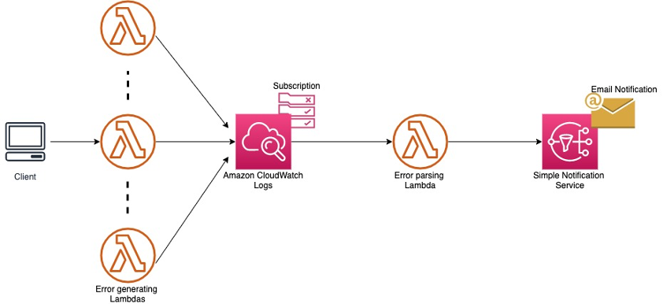

# Lambda-Error-Reporter

## About
The Architecture of this whole process is simple. It uses Publisher/Subscriber pattern to push any new updates. 
Imagine that there are some Lambda functions and you want to be notified about any critical errors occuring in them. So, you make the `AWS CloudWatch` monitor the logs from these Lambda functions and invoke an “error processing” Lambda function whenever a log entry matches a `filter pattern`, for example, ERROR, CRITICAL, or a custom error.
This error processing Lambda function in turn publishes a message to an `Amazon SNS Topic`, to which anyone can subscribe and thus get an email when the error occurs.

**Viusal Representation of the Architecture:**



## What we'll do
The aim is to go through the whole process using CLI and some pre-configured files and get this Error Reporter up and running in no time.

These are some of the steps involved in achieving that goal:
- Creating an AWS SNS topic and subscribing to it
- Creating an IAM role for allowing the Lambda Function to:
    * publish to an SNS topic
    * have Cloudwatch Logs as a trigger.
- Creating a Lambda function that processes the error message and notifies the Subscribers.
- Adding a CloudWatch Log trigger to the above created Lambda and adding the filter pattern that you want the Logs to monitor.

## Detailed Walkthrough

Let's begin the Process of creating this reporter now!!

First of all, clone this repository and open it in your command prompt. This is important because you'll be using the files attached in this repository as input to many of the CLI commands mentioned below.

**Pre-requisites:**

This guide assumes that you've already installed ***AWS CLI*** and set up the ***AWS Profile*** where you want the reporter to be.
If you've not done any of these steps, here are some helpful links:
- [Installing AWS CLI](https://docs.aws.amazon.com/cli/latest/userguide/getting-started-install.html)
- [Configuring the Profile](https://docs.aws.amazon.com/cli/latest/userguide/cli-configure-quickstart.html)

Also, make sure that you have the required permissions to make changes to these AWS Services. Contact the Dev Ops team if you encounter any ***AccessDenied*** Exception.

**Creating an AWS SNS Topic**

CLI command to create an SNS topic:
```
aws sns create-topic --cli-input-json file://sns-topic.json
```
Copy the `Topic ARN` that is returned upon executing this command. It will be used in the next step.

Check out the `sns-topic.json` file above to find out information about parameters to this command.
- `Name` is the name of the topic that will be created.
- `DisplayName` is the alias that will be used as the sender of the Email/SMS etc. whenever a new message is published.

You can refer to the [official docs](https://docs.aws.amazon.com/cli/latest/reference/sns/create-topic.html) on this for further details.

**Subscribing to the Topic**

CLI command to subscribe to an SNS topic:
```
aws sns subscribe --cli-input-json file://subscribe.json
```

Check out the `subscribe.json` file above to find out information about parameters to this command.
- `TopicARN` is the SNS Topic that you copied in the previous step.
- `Protocol` is the mode of communication that will be used to update the subscriber.
- `Endpoint` is the actual user that subscribes to the topic. It can be an Email/Phone Number/URL depending on teh protocol being used.

You can refer to the [official docs](https://docs.aws.amazon.com/cli/latest/reference/sns/subscribe.html) on this for further details.

**Confirming the Subscrition**

By now, you will have received an Email (or an SMS, depending on subscription type) on the Endpoint that you specified in the previous step to confirm this subscription.
And it will probably look something like this:

<br />Confirm the subscription before moving on to the next step.

**Creating a Policy**

CLI command to create a Policy:
```
aws iam create-policy --policy-name error-report-policy --policy-document file://policy.json
```
Copy the `Policy ARN` that is returned upon executing this command. It will be used in the next step.

Check out the `policy.json` file above to find out information about the policy statement that we're creating.

You need to make the following changes to the `policy.json` to reflect your use case:
- On Line 7, paste the `TopicARN` of the SNS Topic created in the earlier steps.  
- On Line 16, update `Resource` info and add a name for the Lambda Function you'll create in the next steps.
<br />Sample Policy:
```
{
    "Version": "2012-10-17",
    "Statement": [
        {
            "Effect": "Allow",
            "Action": "sns:Publish",
            "Resource": "arn:aws:sns:<region>:<AWS account number>:<name of the SNS topic from previous step>"
        },
        {
            "Effect": "Allow",
            "Action": [
                "logs:CreateLogGroup",
                "logs:CreateLogStream",
                "logs:PutLogEvents"
            ],
            "Resource": "arn:aws:logs:<region>:<AWS account number>:log-group:/aws/lambda/<name of the lambda function you are going to create in next step>:*"
        }
    ]
}
```
You can refer to the [official docs](https://docs.aws.amazon.com/cli/latest/reference/iam/create-policy.html) on this for further details.

**Creating a Role**

CLI command to create a Role:
```
aws iam create-role --role-name error-report-role --assume-role-policy-document file://trust-policy.json
```
Copy the `Role ARN` that is returned upon executing this command. It will be used in the next step.

Check out the `trust-policy.json` file above to find out information about the policy statement that we're creating. It basically allows a Lambda (and no one else) to assume this role.

You can refer to the [official docs](https://docs.aws.amazon.com/cli/latest/reference/iam/create-role.html) on this for further details.

Now, we need to attach the Policy Created in the previous step to this Role.

CLI command to attach a Policy with this Role:
```
aws iam attach-role-policy --policy-arn arn:aws:iam::213912083787:policy/error-report-policy --role-name error-report-role
```
You can refer to the [official docs](https://docs.aws.amazon.com/cli/latest/reference/iam/attach-role-policy.html) on this for further details.

**Creating the Lambda Function**

There are some things we need to do before we can create the Lambda Function. First of all, take a look at the pre-configured code for the function in the file `index.js`. It works well to send out an Email regarding the Error. If you want to modify it to suit your use case, you can do so.
<br />Read up on [this](https://docs.aws.amazon.com/sdk-for-javascript/v3/developer-guide/sns-examples.html) official guide for some other ways to publish to an SNS.

If you do end up making some changes to the code, use the command `zip -r9 lambda.zip index.js` to compress it into a zip archive again.

Current code uses an Environment Variable to fetch the `Topic ARN` that it publishes to. So, in the `environment.json` file, change the `snsARN` to your SNS Topic ARN.

Also, make sure that you have the `Role ARN` from the previous step in hand, it will be used in the command.

Now, you're ready to create the Lambda.

CLI command to create a Lambda Function:
```
aws lambda create-function --function-name Error-Reporter --runtime nodejs14.x --zip-file fileb://lambda.zip --handler index.handler --environment file://environment.json --role "arn:aws:iam::213912083787:role/error-report-role"
```

After executing this, you should have successfully created a Lambda Function with all the required Code and Config to work out of the Box.

**Adding the Cloudwatch Trigger**

The final step of the way is to add a Cloudwatch Trigger that invokes the error reporter upon encountering an error.

We can do this by adding a Subscription Filter to the Lambda Function and passing a Filter Pattern that it can subscribe to.

But first, we need to give the log group, that we want to monitor, the ability to invoke the error reporter lambda function. 

CLI command to add the necessary permissions:
```
aws lambda add-permission --function-name "Error-Reporter" --statement-id "Error-Reporter" --principal "logs.us-east-1.amazonaws.com" --action "lambda:InvokeFunction" --source-arn "arn:aws:logs:us-east-1:213912083787:log-group:/aws/lambda/Error-Reporter" --source-account "213912083787"
```

Once these permissions are added, we can go ahead and put the subscription filter on the Lambda.

CLI command to add the Subscription Filter:
```
aws logs put-subscription-filter --cli-input-json file://subscription-filter.json
```

Check out the `subscription-filter.json` file above to find out information about parameters to this command.
- `logGroupName` is the Log Group that you want to monitor for error. (Each Lambda has its own log group)
- `filterName` is the name of the Subscription Filter.
- `filterPattern` is the actual pattern that the subscriber looks out for in the logs. It can be any of the common errors that are emitted like ERROR, CRITICAL etc. or a custom error.
- `destinationArn` is the ARN of the service that is triggered upon encountering the Filter Pattern i.e.; the above created lambda function in our case. 

You can refer the [official Subscription Filter docs](https://docs.aws.amazon.com/AmazonCloudWatch/latest/logs/SubscriptionFilters.html) for further details.

You can subscribe as many log groups to this error reporter as you like. However, a maximum of two subscription filters can be added on a single log group.

## Final Results

After this whole process, whenever any of the monitored lambda encounters an error, you will get an Email Notification containing the Log Group that is reporting the Error as well as the Error Message itself.


<br />Thank You for following along!
